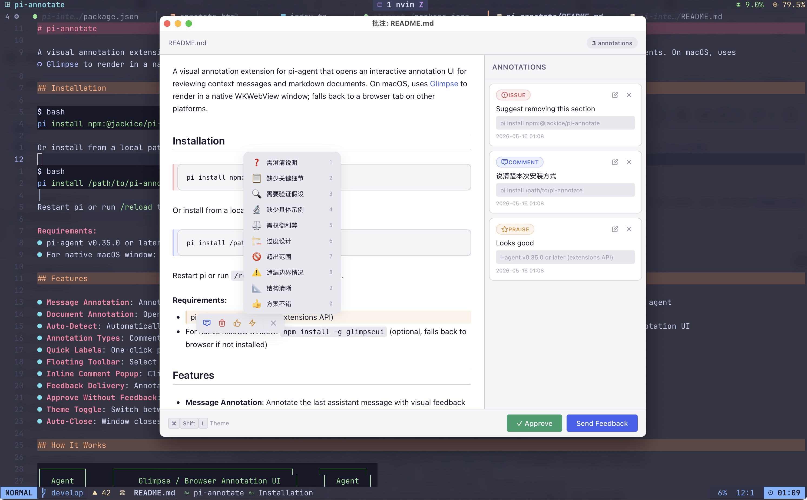

# pi-annotate

A visual annotation extension for pi-agent that opens an interactive annotation UI for reviewing context messages and markdown documents. On macOS, uses [Glimpse](https://github.com/hazat/glimpse) to render in a native WKWebView window; falls back to a browser tab on other platforms.

<p align="center">
  
  <br>
  <em>Annotation UI: select text to reveal a floating toolbar, annotations appear in the right panel</em>
</p>

## Installation

```bash
pi install npm:@jackice/pi-annotate
```

Or install from a local path:

```bash
pi install /path/to/pi-annotate
```

Restart pi or run `/reload` to load the extension.

**Requirements:**
- pi-agent v0.35.0 or later (extensions API)
- For native macOS window: `npm install -g glimpseui@">=0.8.1"` (optional, falls back to browser if not installed) — Glimpse 0.8.1+ required for native clipboard support (`⌘C`/`⌘V`)

## Features

- **Message Annotation**: Annotate the last assistant message with visual feedback — select text, add comments, and send feedback to the agent
- **Document Annotation**: Open any markdown file (specs, plans, design docs) in a visual annotation UI
- **Auto-Detect**: Automatically detects new spec/plan documents in `docs/superpowers/specs/` or `docs/superpowers/plans/` and opens the annotation UI
- **Annotation Types**: Comment, Suggestion, Issue, and Praise — each with distinct color coding
- **Quick Labels**: One-click preset labels for common feedback (needs clarification, missing details, verify assumption, etc.)
- **Floating Toolbar**: Select text to reveal a compact toolbar with Comment, Delete, Quick Label, and Looks Good actions
- **Inline Comment Popup**: Click Comment on the toolbar to add detailed text feedback directly above/below the selected text
- **Feedback Delivery**: Annotations are sent back to the agent as a structured follow-up message
- **Approve Without Feedback**: When no annotations exist, approve documents directly
- **Theme Toggle**: Switch between dark and light themes with `⌘+Shift+L` (`Ctrl+Shift+L` off macOS)
- **Auto-Close**: Window closes automatically after submitting feedback or approving

## How It Works

```
┌─────────┐     ┌──────────────────────────────────────┐     ┌─────────┐
│  Agent  │     │     Glimpse / Browser Annotation UI   │     │  Agent  │
│ writes  ├────►│                                      ├────►│receives │
│  doc    │     │  select text → add annotation → send  │     │feedback │
└─────────┘     │         ↑                             │     └─────────┘
                │         └── auto-detect path ─────────┤
                └──────────────────────────────────────┘
```

**Lifecycle:**
1. Agent writes a spec/plan document, or you run `/annotate <file>` or `/annotate-last`
2. Local server starts → Glimpse window opens (macOS) or browser tab (elsewhere)
3. Select text in the document → floating toolbar appears with annotation actions
4. Add annotations via Comment (text input), Quick Label (preset labels), Delete (suggest removal), or Praise (looks good)
5. Session ends via:
   - **Send Feedback** → annotations sent back to agent as follow-up message
   - **Approve** → document approved, no feedback sent (available when no annotations exist)
   - **Close window** → session ends without feedback
6. Window closes automatically after sending feedback or approving

## Usage

The extension provides two slash commands and one auto-detection hook:

### `/annotate-last`

Annotate the last assistant message in the current session:

```
/annotate-last
```

Select text in the message, add annotations or quick labels, and send feedback to the agent.

### `/annotate <file>`

Annotate a specific markdown file:

```
/annotate docs/superpowers/specs/my-design.md
/annotate PLAN.md
```

Supports:
- Relative paths (from current working directory)
- Absolute paths
- `@` prefix notation (e.g., `@docs/superpowers/specs/...`)

### Auto-Detect

When an agent creates or modifies a file under `docs/superpowers/specs/` or `docs/superpowers/plans/`, the extension automatically detects the file path in the assistant's response and opens the annotation UI.

## Annotation UI

### Floating Toolbar

Select any text to reveal a floating toolbar with four actions:

| Button | Action | Description |
|--------|--------|-------------|
| 💬 Comment | Opens text input | Type detailed feedback about the selected text |
| 🗑️ Delete | Creates issue annotation | Suggests removing the selected section |
| ⚡ Quick Label | Opens preset picker | One-click labels for common feedback |
| 👍 Looks Good | Creates praise annotation | Marks the selected text as good |

### Quick Labels

Preset labels for common feedback on specs, plans, and messages:

| Key | Label | Description |
|-----|-------|-------------|
| 1 | ❓ Needs Clarification | The selected section requires further explanation |
| 2 | 📋 Missing Details | Key details or specifics are absent |
| 3 | 🔍 Verify Assumption | Underlying assumption needs to be validated |
| 4 | 🔬 Missing Example | A concrete example would improve understanding |
| 5 | ⚖️ Trade-off Analysis | Pros and cons of this approach should be discussed |
| 6 | 🏗️ Over-engineered | The proposed solution is more complex than needed |
| 7 | 🚫 Out of Scope | This item falls outside the defined scope |
| 8 | ⚠️ Edge Case Missing | Potential edge cases have not been addressed |
| 9 | 📐 Well-structured | The structure and organization are clear |
| 0 | 👍 Good Approach | The proposed approach is sound |

### Annotation Panel

All annotations appear in the right sidebar panel. Each annotation shows:
- Type badge with color coding (Comment/Suggestion/Issue/Praise)
- Annotation text
- Original selected text preview
- Timestamp
- Edit (✏️) and Delete (🗑️) buttons

## Keyboard Shortcuts

| Key | Action |
|-----|--------|
| `⌘+Shift+L` | Toggle dark/light theme (`Ctrl` off macOS) |
| `1`-`9`, `0` | Select Quick Label by number (when picker open) |

## File Structure

```
pi-annotate/
├── index.ts              # Extension entry point, commands, Glimpse integration
├── server.ts              # Annotation HTTP server (API routes)
├── form/
│   └── annotate.html      # Annotation UI (pure HTML/CSS/JS, no build step)
├── package.json
└── README.md
```

## Feedback Format

When you send feedback, the agent receives a structured message like:

```
## Annotation Feedback

The following feedback was provided for docs/superpowers/specs/my-design.md:

- **suggestion**: Consider adding concrete API design details
  > Original text: "Communication uses a RESTful API"

- **issue**: Error handling strategy is missing
  > Original text: "The system will return an error message on failure"

Please address the issues above.
```

The ending is context-aware:
- If there are **issues**: "Please address the issues above."
- If there are **suggestions**: "Please revise according to the suggestions above."
- Otherwise: "Please consider the feedback above."

## Limits

- Max 5MB request body for feedback submission
- 2-minute idle timeout auto-closes the server
- Single concurrent annotation session
